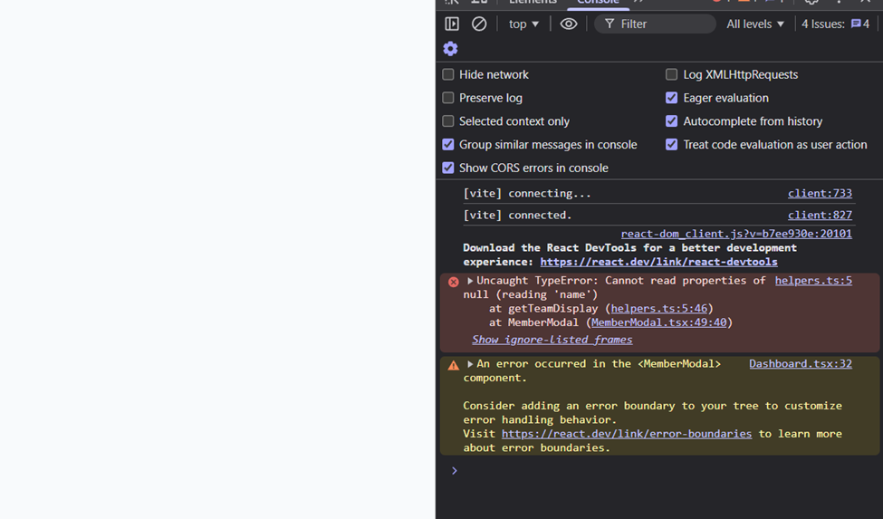

# BUG REPORT

## Bug 1 — Crash on Member Card When No Team Assigned

**File:** `src/utils/helpers.ts` — `getTeamDisplay()`

**Symptom:**
Error page appeared on screen when clicking a member card that had no team assigned.

**Root Cause:**
The code was trying to access `member.team.name` without first checking whether `team` is an object and actually has a `name` property. When `team` was `undefined`, `null`, or a primitive, this threw a runtime error that crashed the component tree.

**Fix:**
Added a guard that checks `typeof member.team === 'object'`, `member.team !== null`, and `'name' in member.team` before accessing `.name`. If any condition fails, the function returns `'Unassigned'`.

**Connected to:** None directly, though it shares the helpers module with Bug 2.

---

## Bug 2 — Notification Click Always Selected the Wrong Item

**File:** `src/utils/helpers.ts` — `bindNotificationHandlers()`

**Symptom:**
Clicking any notification always selected the last notification (or the default `-1` value) instead of the one actually clicked.

**Root Cause:**
The loop variable `i` was declared with `var`, which is function-scoped. By the time a click handler executed, the loop had already finished and `i` held its final value, so every handler read the same (out-of-bounds) index and fell back to `-1`.

**Fix:**
Changed `var` to `let` for the loop variable. `let` is block-scoped, so each iteration captures its own value of `i`, and handlers reference the correct notification.

**Connected to:** None.

---

## Bug 3 — Batch Role Assign Toast Appeared Instantly

**File:** `src/utils/batchOperations.ts` — `batchAssignRole()`

**Symptom:**
The "All roles updated" success toast appeared the instant the batch assign button was clicked, even though each API call takes time.

**Root Cause:**
`forEach` does not `await` async callbacks — it fires all promises and moves on synchronously. The success toast ran immediately after the loop, and the `try/catch` never caught errors because the promises were already detached (fire-and-forget).

**Fix:**
Replaced `forEach` + `setTimeout` with `Promise.allSettled` and `.map`. This waits for every update to either resolve or reject, counts the failures, and only then calls `onSuccess`. The toast now appears after all operations truly complete.

**Connected to:** Bug 12 (Toast animation). If the toast fired before the animation setup had a chance to register the initial state, the entry animation would be skipped entirely, compounding both bugs.

---

## Bug 4 — Duplicate Activities in the Activity Feed

**File:** `src/components/ActivityFeed/ActivityFeed.tsx` — `useEffect` for fetching

**Symptom:**
The activity feed displayed multiple duplicate activities.

**Root Cause:**
The fetch effect was appending new data to the existing activities array instead of replacing it. On re-renders or re-mounts (e.g. Strict Mode), each fetch doubled the list.

**Fix:**
Clear the existing activities before setting the new ones — use a fresh set rather than concatenating to the previous state.

**Connected to:** Bug 5 (Activity key rendering). Duplicate data combined with non-unique keys caused React to confuse which DOM node belonged to which activity, making the duplication worse and notes to appear on wrong items.

---

## Bug 5 — Activity Notes Mixed Up When Sorting or Filtering

**File:** `src/components/ActivityFeed/ActivityFeed.tsx` — list rendering

**Symptom:**
Activity notes were not updating correctly when the sort order or filter changed; notes appeared attached to the wrong activities.

**Root Cause:**
The list `key` used during rendering was not unique (e.g. array index). React reused DOM nodes across renders and associated internal state (like notes) with the wrong activity items.

**Fix:**
Changed the `key` to `activity.id`, which is unique per activity. Also added a loading state to prevent rendering stale data during fetches.

**Connected to:** Bug 4 (Duplicate activities). When duplicates existed, even index-based keys couldn't disambiguate, making both bugs compound each other.

---

## Bug 6 — Console Warning from Search Query State

**File:** `src/components/Header/Header.tsx` — `useState` for query

**Symptom:**
A React warning appeared in the browser console.

**Root Cause:**
The query state was being set to `undefined` (an uncontrolled value), which React flags as switching from controlled to uncontrolled. This happened because the initial value was not set to an empty string.

**Fix:**
Initialized the state with an empty string (`''`) to keep the input permanently controlled.

**Connected to:** Bug 7 (Stale search results). Both bugs are in the Header's search flow — an undefined query state could also contribute to unexpected filtering behavior.

---

## Bug 7 — Stale Search Results Flashing

**File:** `src/components/Header/Header.tsx` — search `useEffect` debounce

**Symptom:**
Old results from a previous search briefly flashed on screen before the current results appeared.

**Root Cause:**
There was no cancellation mechanism for the debounced search. When the user typed quickly, earlier timeouts still resolved and wrote their (now outdated) results into state after a newer query had already been issued.

**Fix:**
The cleanup function now clears the pending `setTimeout` and sets a `cancelled` flag. When a stale callback fires, it checks the flag and discards itself, so only the latest search ever writes results.

**Connected to:** Bug 6 (Console warning). Both affect the same Header search pipeline.

---

## Bug 8 — Infinite Re-render Loop from Greeting State

**File:** `src/components/Header/Header.tsx` — greeting computation

**Symptom:**
The page re-rendered infinitely, freezing the UI.

**Root Cause:**
`computeGreeting()` was called inside a `useEffect` that set state on every run, which triggered another render, which triggered the effect again — an infinite loop. The greeting doesn't depend on user interaction, so it never needed to be in state at all.

**Fix:**
Removed the greeting from React state. It is now computed once as a plain variable (or memoized constant), breaking the render ➝ effect ➝ setState ➝ render cycle.

**Connected to:** Bug 9 (MemberGrid jitter). An infinite re-render loop in the Header causes the entire app to re-render non-stop, which directly worsens the jitter seen in MemberGrid.

---

## Bug 9 — Jittery UI When Filters Change

**File:** `src/components/MemberGrid/MemberGrid.tsx` — `useEffect` dependency

**Symptom:**
The member grid visually jittered (flickered / jumped) every time a filter was changed.

**Root Cause:**
The `members` array was being recreated as a new reference on every render. Because the effect depended on it, each render triggered the effect, which set state, which caused another render — an unstable loop producing visible jitter.

**Fix:**
Memoized the members array (e.g. with `useMemo`) so it only changes when the underlying data or filters actually change, preventing unnecessary effect re-runs.

**Connected to:** Bug 11 (FilterContext state mutation). If filter state mutations didn't produce new references, React might batch-skip updates and then suddenly catch up, amplifying the visual jitter. Fixing both together stabilizes the filter ➝ grid pipeline.

---

## Bug 10 — Bookmark Count Showed Wrong Number After Filtering

**File:** `src/components/MemberGrid/MemberGrid.tsx` — bookmark count

**Symptom:**
Bookmarking 3 members and then filtering to "On Leave" still showed "Bookmarked: 3" even though 0 or 1 of those bookmarked members were visible under the current filter.

**Root Cause:**
The bookmarked count was calculated from the full, unfiltered `members` array rather than the currently displayed (filtered) array.

**Fix:**
Changed the count to derive from `displayMembers` (the filtered array) so it reflects only bookmarked members that are actually visible on screen.

**Connected to:** Bug 11 (FilterContext state mutation). If filters weren't updating properly due to direct state mutation, the filtered array wouldn't change, meaning the count would also stay stale. Both fixes together ensure the count is always accurate.

---

## Bug 11 — Filter Radio Buttons Not Updating the UI

**File:** `src/context/FilterContext.tsx` — `updateFilter()`

**Symptom:**
Clicking a different status radio button did not update the UI; the previous status remained visually selected.

**Root Cause:**
The state object was being mutated directly (`filters[key] = value`) instead of creating a new object. React uses referential equality to detect changes — since the same object reference was passed to `setFilters`, React saw no change and skipped the re-render.

**Fix:**
Created a new object via spread (`{ ...prev, [key]: value }`) to produce a new reference. React detects the new reference and re-renders the component tree.

**Connected to:** Bug 9 (MemberGrid jitter) and Bug 10 (Bookmark count). This is the upstream bug — when filters don't propagate, everything downstream (grid content, bookmark count) stays stale. Fixing this was a prerequisite for the other two fixes to take effect.

---

## Bug 12 — Toast Entry Animation Not Playing

**File:** `src/components/Toast/ToastContainer.tsx` — `ToastItem` animation

**Symptom:**
Toasts appeared on screen without any entry animation — they just popped in statically.

**Root Cause:**
The `toast--visible` CSS class (which triggers the CSS transition) was added in the same render frame as the component mount. The browser never painted the initial (pre-animation) state, so there was no starting point for the transition — it was skipped entirely.

**Fix:**
Added a small delay (e.g. `requestAnimationFrame` or `setTimeout(…, 0)`) before adding the `toast--visible` class. This gives the browser one frame to paint the initial state, then the class change triggers the intended CSS transition.

**Connected to:** Bug 3 (Batch toast timing). If the toast also fired too early (before all operations completed), users saw a flash of a static toast rather than a smoothly animated one, compounding both issues.

---

## Bug 13 — Standup Timer Seconds Not Counting Down

**File:** `src/components/Timer/StandupTimer.tsx` — `setInterval` callback

**Symptom:**
The seconds display on the standup timer was stuck and never counted down.

**Root Cause:**
The `setInterval` callback captured the initial `timeLeft` value via closure (stale closure). On every tick it read the same frozen value, computed the same result, and wrote it back — the timer never progressed.

**Fix:**
Switched to the functional updater form of `setTimeLeft`: `setTimeLeft(prev => prev - 1)`. The updater always receives the latest state value, eliminating the stale closure problem.

**Connected to:** None.

---

## Bug 14 — Member Grid Showing 3 Columns on Mobile Instead of 1

**File:** `src/components/MemberGrid/MemberGrid.tsx`

**Symptom:**
On mobile viewports, the member grid still displayed 3 columns instead of stacking into a single column as intended by the responsive CSS.

**Root Cause:**
An inline `style` attribute on the grid container (`style={{ gridTemplateColumns: \`repeat(\${columns}, 1fr)\` }}`) was overriding the CSS media-query breakpoints. Inline styles have higher specificity than any stylesheet rule, so the responsive `grid-template-columns: 1fr` from the media query was completely ignored at all viewport widths.

**Fix:**
Removed the inline `gridTemplateColumns` style so the CSS media queries can take effect and properly control the column count at each breakpoint.

**Connected to:** Bug 9 (Grid jitter). Both bugs involve the MemberGrid layout — the inline style also interfered with the memoization fix for Bug 9, since changing `columns` caused unnecessary re-renders.

---


## Bug 15 — Dashboard Resize Handler Memory Leak and Dead Code

**File:** `src/pages/Dashboard.tsx` — `useEffect` resize handler

**Symptom:**
A `console.log('resize handler fired')` appeared every time the window was resized. Navigating away from the dashboard and back stacked duplicate listeners. On unmount, the orphaned listeners attempted to call `setGridCols` on an unmounted component.

**Root Cause:**
The `useEffect` added a `resize` event listener but never returned a cleanup function to remove it. Each mount added another listener. Additionally, the `gridCols` state and the `columns` prop it fed into `MemberGrid` were never used in the grid's actual rendering — the responsive layout was handled entirely by CSS media queries, making the entire resize handler dead code.

**Fix:**
Removed the `useEffect` resize handler, the `gridCols` state, and the unused `columns` prop from `MemberGrid`. The responsive column layout is fully controlled by the existing CSS media queries.

**Connected to:** Bug 14 (Inline grid style). Both involved redundant column-count logic that conflicted with the CSS-based responsive layout.

---

## Bug 16 — No Error Handling on Data Fetches (Blank Screen on API Error)

**Files:** `src/components/MemberGrid/MemberGrid.tsx`, `src/components/ActivityFeed/ActivityFeed.tsx`, `src/components/StatsCards/StatsCards.tsx`

**Symptom:**
If the API returned an error (network failure, server error, etc.), the loading spinner hung forever and the user saw a blank screen with no feedback. No error message was ever displayed.

**Root Cause:**
The `fetchMembers()` and `fetchActivities()` calls used `.then()` but had no `.catch()` handler. When the promise rejected, the `setLoading(false)` call inside `.then()` never executed, so the component stayed in its loading state permanently. The CSS class `.member-grid__error` already existed but was never used.

**Fix:**
Added `.catch()` handlers to all fetch calls in `MemberGrid`, `ActivityFeed`, and `StatsCards`. On error, an `error` state is set and displayed to the user (e.g. "Failed to load members. Please try again later."). Also added a `cancelled` flag via the `useEffect` cleanup to prevent state updates on unmounted components when navigating away during a pending fetch.

**Connected to:** Bug 17 (No abort on unmount). Both are missing fetch lifecycle safeguards — the `.catch()` handles rejections while the `cancelled` flag prevents stale state updates after unmount.

---

## Bug 17 — Navigating Away During Fetch Causes State-Update Warnings

**Files:** `src/components/MemberGrid/MemberGrid.tsx`, `src/components/ActivityFeed/ActivityFeed.tsx`, `src/components/StatsCards/StatsCards.tsx`

**Symptom:**
Navigating away from a page while data was still loading could produce console warnings about calling `setState` on an unmounted component.

**Root Cause:**
The `useEffect` hooks that fetched data did not return cleanup functions. When the component unmounted (e.g. navigating to another page), the in-flight promise's `.then()` callback still executed and tried to call `setMembers` / `setLoading` on the now-unmounted component.

**Fix:**
Added a `cancelled` flag in each fetch `useEffect`. The cleanup function sets `cancelled = true`, and the `.then()` / `.catch()` callbacks check this flag before calling any state setters — if cancelled, they silently discard the result.

**Connected to:** Bug 16 (No error handling). Both fixes were applied together since they address the same fetch lifecycle gaps.

---

## Bug 18 — Adding a Tag to One Member Could Leak to Others (Shallow Copy Mutation)

**File:** `src/components/MemberModal/MemberModal.tsx` — `handleAddTag()`

**Symptom:**
Adding a tag to a member in the modal could, under certain conditions, cause that tag to appear on the member's card in the grid even after closing and reopening — or leak into the original member object shared across components.

**Root Cause:**
The `handleAddTag` function used a shallow spread (`{ ...selectedMember }`) to "clone" the member, but `tags` is an array, so `updated.tags` was still the **same reference** as the original member's `tags` array. Calling `.push()` on it mutated the original array in-place, bypassing React's state management. Any other component holding a reference to that member object would silently see the mutation.

**Fix:**
Replaced the shallow copy + `.push()` with a proper immutable update:
```js
const updated = { ...selectedMember, tags: [...selectedMember.tags, newTag.trim()] };
```
This creates a new `tags` array, leaving the original untouched.

**Connected to:** None directly. This is a standalone immutability violation in the modal.


## Connection Summary

| Bug | Directly Connected To | Relationship |
|-----|----------------------|--------------|
| 3 (Batch toast timing) | 12 (Toast animation) | Early toast + missing animation compound into invisible feedback |
| 4 (Duplicate activities) | 5 (Activity key) | Duplicate data + non-unique keys make both worse |
| 5 (Activity key) | 4 (Duplicate activities) | Same as above, bidirectional |
| 6 (Console warning) | 7 (Stale results) | Both in Header search pipeline |
| 7 (Stale results) | 6 (Console warning) | Same pipeline |
| 8 (Infinite re-render) | 9 (Grid jitter) | Infinite renders cause downstream jitter |
| 9 (Grid jitter) | 11 (Filter mutation), 14 (Inline grid style) | Filter mutation prevents proper memoization; inline style overrides responsive CSS |
| 10 (Bookmark count) | 11 (Filter mutation) | Stale filters → stale filtered array → wrong count |
| 11 (Filter mutation) | 9, 10 | Upstream cause for grid jitter and bookmark count |
| 14 (Inline grid style) | 9 (Grid jitter) | Both affect MemberGrid layout behavior |
| 15 (Resize handler leak) | 14 (Inline grid style) | Both involve dead responsive-column logic in Dashboard |
| 16 (No fetch error handling) | 17 (No fetch abort on unmount) | Both are missing fetch lifecycle safeguards |
| 18 (Tag mutation) | None | Standalone shallow-copy bug in MemberModal |

---

## UI Enhancement — Hamburger Menu for Mobile Sidebar

A hamburger (☰) menu button was added to the Header, visible only on mobile (≤768px). Tapping it slides the sidebar in as an overlay with a close (✕) button and a backdrop. This replaces the always-visible desktop sidebar on narrow screens for a better mobile experience.

---